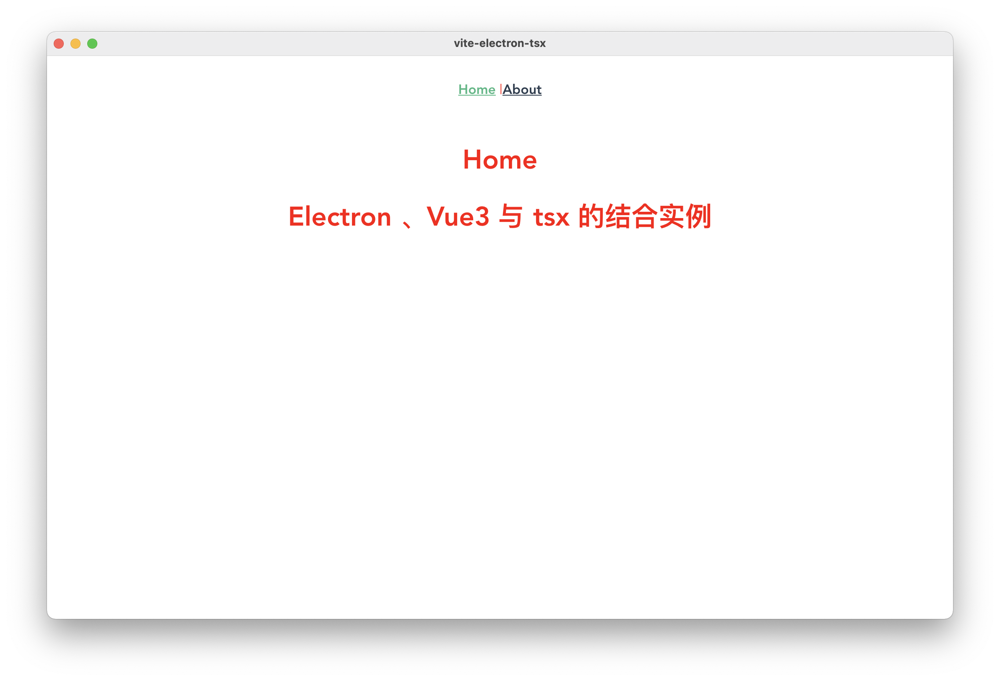

# vite-electron-tsx

主要使用 vite 构建项目，vue3 的 tsx 语法写界面，electron 构建桌面程序的解决方案

## 源码地址

[【Github 地址】](https://github.com/xygengcn/vite-electron-tsx)

[【博客地址】](https://xygeng.cn/post/303.html)

## 实例



## 使用 (推荐 pnpm)

- ### 安装依赖

```sh
pnpm install
```

- ### 运行

```sh
pnpm run dev
```

- ### 打包

```sh
pnpm run build
```

## 安装 vue devtools

https://chrome.google.com/webstore/detail/vuejs-devtools/ljjemllljcmogpfapbkkighbhhppjdbg?hl=en

1、下载插件放在本地项目的拓展上，mac 地址在/Users/用户名/Library/Application Support/项目名/extensions

2、如果 id 文件夹有版本号文件夹套着，需要把文件夹里面的文件放在第一级目录

3、安装依赖

```
yarn add electron-devtools-installer -D
```

```ts
// main.ts
import Extension from 'electron-devtools-installer';

app.whenReady().then(() => {
  const vue_devtools_beta = { id: 'ljjemllljcmogpfapbkkighbhhppjdbg', electron: '>=1.2.1' };
  Extension(vue_devtools_beta)
    .then(() => {
      console.log('Vue-tools安装成功 \n');
    })
    .catch((err) => {
      console.log('Vue-tools安装失败: \n', err);
    })
    .finally(() => {
      new createWin();
    });
});
```
